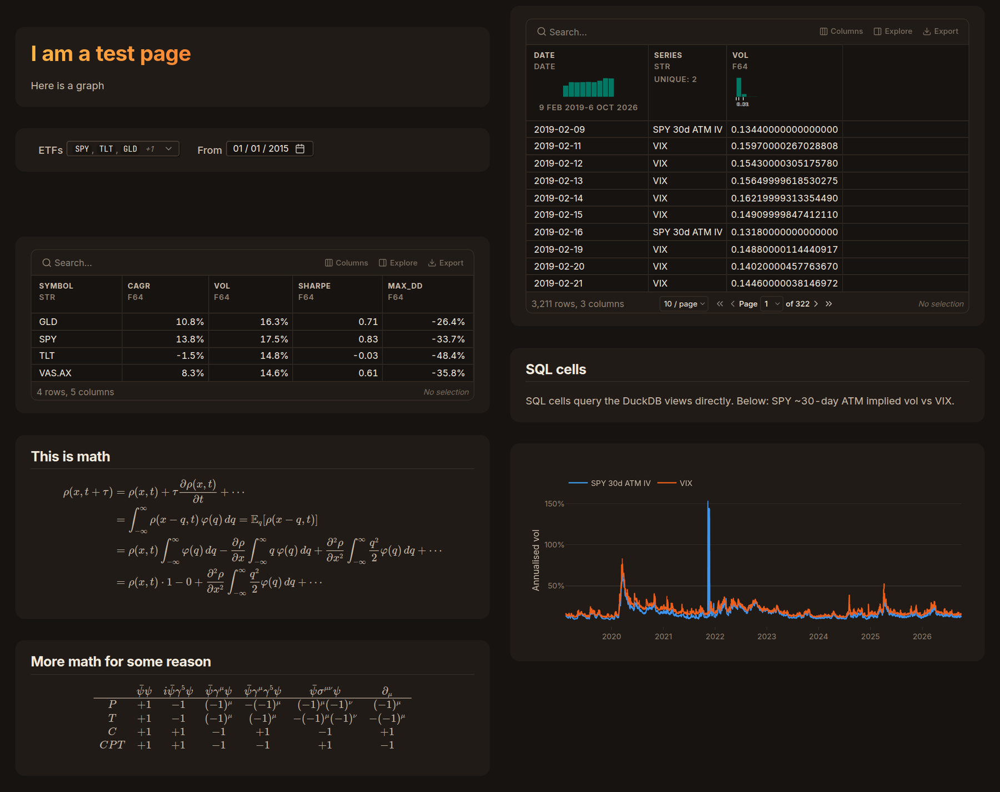
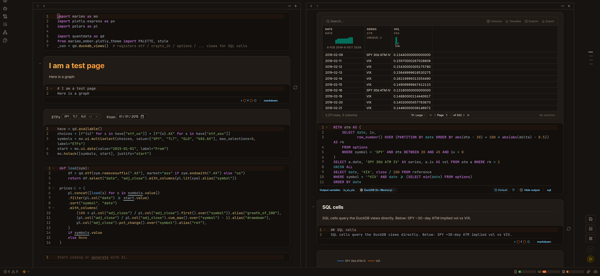

# marimo-ember

A warm dark custom css theme-injection for [marimo](https://marimo.io), with a matching Plotly template. 
Beyond superficial visual changes, this is mostly useless; it only
changes the appearance of the marimo notebook editor and plotly graphs.




## Install

```sh
uv add "marimo-ember[plotly] @ git+https://github.com/ParticleCat314/marimo-ember"
uv run marimo-ember install theme    # writes theme/ember.css
```

Add this to `pyproject.toml` and restart marimo:

```toml
[tool.marimo.display]
theme = "dark"
custom_css = ["theme/ember.css"]
```

## Plotly

```python
from marimo_ember.plotly_theme import PALETTE, style  # sets "ember" as the default template

style(px.line(df, x="date", y="close", color="symbol"), height=360, yfmt=".0%")
```

`PALETTE` has 8 colours.

## Statement of Disclosure
Most of this was written with AI, do with that knowledge what you will.
